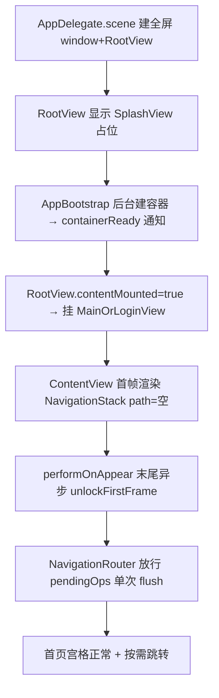

## 用户需求

用户需要 App 能够正常启动并进入首页（不再白屏、不再被系统强杀）。

## 问题背景

路线 A 入口改造（UIKit 入口 + AppDelegate 兼 UISceneDelegate + 自建全屏 window）后，App 冷启动即白屏。日志确认根因：`Update NavigationRequestObserver tried to update multiple times per frame` 断言触发后主线程死循环，被系统看门狗 signal 9 强杀。

## 核心修复目标

在保留路线 A 全部收益（全屏无黑边、热启动快捷项可接收）的前提下，精准修掉启动卡死：保证 ContentView 首帧渲染期间 NavigationStack 的 path 绝对不抖动（恒为 []），所有导航 flush 延后到首帧渲染完成之后，从机制上根绝同帧多次 path 更新断言。

## 核心特性

- NavigationRouter 新增「首帧冻结」闸门：before ContentView 首帧完成前，所有 navigate/replaceWith/pop 请求只入队、不提交 path 更新。
- ContentView 首帧渲染干净结束后解除冻结，统一提交一次 path 变更（单帧一次，安全）。
- 启动页（SplashView）照常淡出，首页宫格正常呈现，无断言、无卡死、无 signal 9。

## 技术栈

- 现有项目：纯 Swift + SwiftUI + SwiftData，iOS 17.0 部署目标，经典 UIKit 入口（main.swift + AppDelegate）。
- 修改仅涉及两个已存在文件：`QuickActionRouter.swift`（NavigationRouter）、`ContentView.swift`（performOnAppear 解锁点）。不动入口架构、不动 AIAApp.swift/AppDelegate.swift/Info.plist/main.swift。

## 实现方案

### 策略

在 NavigationRouter 增加「首帧冻结」状态机：首帧未解锁时，`enqueue` 仅把导航操作追加进 `pendingOps` 而不排 `asyncAfter` flush；解锁后若队列非空则立即触发一次 flush（复用现有合并提交逻辑，单帧一次 path 改写）。ContentView 首帧 `onAppear` 末尾异步解锁，确保 NavigationStack 首帧绑定 path=[] 的渲染事务彻底结束后再放行导航。

### 关键决策与理由

1. **只加闸门、不改帧合并算法**：现有 `enqueue`/`flush` 的「同帧合并 + asyncAfter(0.12) 跨帧提交」逻辑已验证正确，问题只是「首帧 ContentView 挂载与 router 首次 flush 撞帧」。加首帧闸门代价最小、不动已验证路径，避免引入新回归。
2. **不回退入口文件**：回退会丢掉全屏黑边修复与热启动快捷项能力，且用户已表达「越改越坏」的挫败感，应给出能进首页且不退步的精准修复。
3. **解锁点选在 performOnAppear 末尾的 `DispatchQueue.main.async`**：`onAppear` 本身处于视图更新事务中间，同步改 router 状态仍可能污染首帧；延后到下一个 runloop turn 可保证首帧 body 已提交，与现有 `consume`/`jump` 的延迟块风格一致。

### 性能与可靠性

- 冻结期仅持续首帧渲染（数百毫秒内），不影响正常导航延迟（jump 本身已 0.35s 延迟）。
- 首帧 path 恒为 `[]`，SwiftUI 无多余 path 更新，彻底消除 `_NavigationRequestObserver` 断言触发条件。
- 1.4s 保底超时（RootView.onAppear）保留，作为极端情况下容器通知丢失的双保险。

## 实现细节（落地注意）

- `NavigationRouter` 新增 `private var firstFrameUnlocked = false`，类型内默认 false。
- `enqueue` 改造：开头判断 `if !firstFrameUnlocked { pendingOps.append(op); return }`（不置 flushScheduled、不排 asyncAfter，使解锁后能触发一次 flush）。
- 新增 `func unlockFirstFrame()`：`firstFrameUnlocked = true`；若 `!pendingOps.isEmpty` 则直接调用现有 flush 逻辑（把 pendingOps 取出、清空、按合并规则提交 path）。可抽取现有第 150-177 行闭包体为 `private func flushNow()` 复用，避免重复。
- `ContentView.performOnAppear` 末尾（现有 consume 调用之后）追加 `DispatchQueue.main.async { NavigationRouter.shared.unlockFirstFrame() }`。

## 架构设计

启动流程保持现有分层：



首帧冻结闸门位于 NavigationRouter 层，对所有导航入口（四宫格、快捷项、通知、onboarding）统一生效。

## 目录结构

```
AIA/AIA/
├── QuickActionRouter.swift   # [MODIFY] NavigationRouter 类：新增 firstFrameUnlocked 闸门 + unlockFirstFrame()；enqueue 首帧期只入队不 flush；抽取 flushNow() 复用。
└── ContentView.swift         # [MODIFY] performOnAppear 末尾加 DispatchQueue.main.async { NavigationRouter.shared.unlockFirstFrame() }，首帧渲染完再放行导航。
```