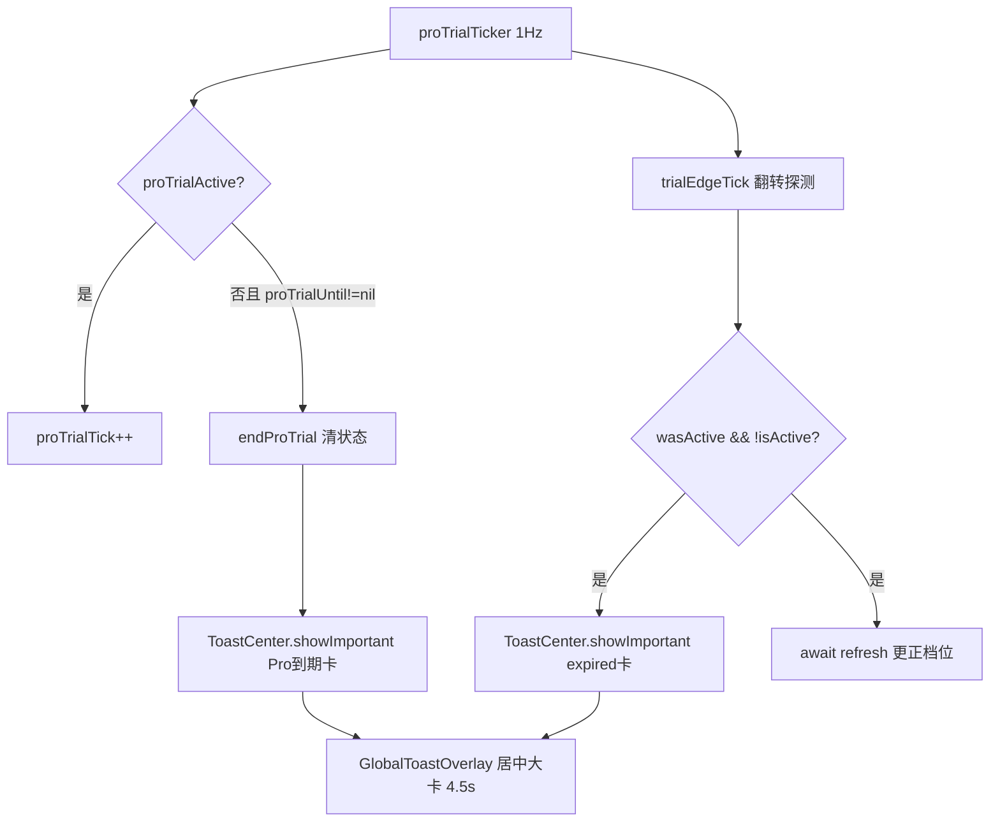

## 用户需求

在会员/权益状态发生「到期」时，弹出一条居中大卡式的重要提示（ToastCenter.showImportant），覆盖两个场景。

## 产品概述

用户在 App 内经历两种权益到期时刻时，不再静默切换档位，而是弹出一个醒目的居中提示大卡，告知体验/免费额度已结束，引导订阅。提示挂在全局 Toast 层，任何页面（聊天页、设置页等）都能看到，4.5 秒后自动消失。

## 核心功能

- Pro 限时体验（10 分钟）自然倒计时结束的那一刻，弹出「Pro 体验已结束，云端功能已收起」提示大卡（带时钟图标、警示红）。
- 30 天免费体验到期或月度额度耗尽、权益档位由 trial/paid 翻转为 expired 的那一刻，弹出「免费体验已结束，订阅后可继续使用云端功能」提示大卡（带锁图标、警示红）。
- 两处提示均利用现有翻转守卫，确保每次到期只弹一次，不重复打扰。

## 技术栈选择

- 语言：Swift + SwiftUI（现有项目，iOS 17.0 部署目标）
- 全局提示：复用现有 `ToastCenter` 单例（`ImageAutoRecogSettingsView.swift` 第 233 行），调用 `showImportant(_:icon:accent:duration:)`，默认 4.5s
- 呈现层：复用已挂载的 `GlobalToastOverlay()`（ContentView.swift 第 679 行 `.overlay(alignment: .top)`），无需新增 UI

## 实现方案

### 总体策略

在两个「到期翻转」的固有代码守卫处直接追加 `ToastCenter.shared.showImportant(...)` 调用，零新增架构、零新文件，完全复用现有全局 Toast 通道。

### 关键触发点（已确认）

1. **Pro 体验自然到点**：`Entitlement.swift` 的 `proTrialTicker` Timer 回调中 `else if self.proTrialUntil != nil { self.endProTrial() }`（第 201-202 行）。`endProTrial()` 是体验结束的唯一出口，在此调用后弹 Pro 到期大卡即可，天然每轮只触发一次（Timer 每 1s 但状态翻转后 `proTrialUntil` 变 nil，后续不再进该分支）。
2. **档位 trial→expired 翻转**：`trialEdgeTick()`（第 213-221 行）已有 `wasActive && !isActive` 守卫，翻转瞬间只跑一次 `await refresh()`。在此守卫块内、`refresh()` 之前或之后追加弹 expired 大卡，天然防重复。

### 关键决策与权衡

- **为何不新增独立观察器**：`@Published plan` 的 `.sink` 观察会面临冷启 `refresh()` 多次、模拟免费档切换等噪声，易误弹。复用现有 `trialEdgeTick` 翻转守卫最精准，与项目现有「边缘探测」范式一致（见该注释）。
- **为何两处独立弹**：Pro 体验（`isTempPro`）与 30 天试用（`trialActive`）是两条独立状态链，互不影响；Pro 到点不改变 `trialActive`，故不会误触发 expired 卡，反之亦然。符合用户「两种都加」的要求且无重叠。
- **调用安全**：`EntitlementManager` 与 `ToastCenter` 均为 `@MainActor`；Timer 回调已用 `Task { @MainActor in ... }` 包裹，可直接在主线程调用 `ToastCenter.shared.showImportant`，无跨线程风险。

### 性能与可靠性

- Toast 调用为无副作用的纯展示，开销可忽略；`showImportant` 自带 `hideTask` 去重与自动隐藏，连点不会堆叠。
- 不引入新 Timer / 新 @State，不增加内存或主线程负担。

## 实现注意事项

- 文案与 `PaywallView.swift` 第 93 行 expired 文案风格对齐（「体验已结束，订阅后可继续使用云端功能」）。
- 图标用 SF Symbols 或 emoji：`"timer"` / `"lock.fill"` 均可；accent 用 `AIATheme.over`（项目语义警示红，见 MembershipCompareView.swift 第 98 行 expired 配色）。
- 不改 ContentView、GlobalToastOverlay、ToastCenter 本体；仅在 Entitlement.swift 两处守卫内加一行调用。
- 不触碰 `withAnimation` 包模型变更等既有铁律；Toast 调用延后于状态翻转，符合「副作用延后 main.async」惯例（Timer 回调已在主线程 Task 内）。

## 架构设计

现有架构不变。仅扩展 `EntitlementManager` 内部两个既有状态守卫，向全局 Toast 通道发一条消息。



## 目录结构

```
AIA/AIA/
└── Entitlement.swift   # [MODIFY] 在 endProTrial 自然到点分支（proTrialTicker 回调）与 trialEdgeTick 翻转守卫内，各追加一行 ToastCenter.shared.showImportant(...) 调用。不改其它逻辑，不新增方法/属性。
```

（注：ToastCenter / GlobalToastOverlay / ContentView 均已就绪，无需改动；本任务仅改 Entitlement.swift 一个文件。）

## 关键代码结构

无需新增类型或接口；复用现有：

- `ToastCenter.shared.showImportant(_ text: String, icon: String? = nil, accent: Color? = nil, duration: TimeInterval = 4.5)`
- `EntitlementManager.endProTrial()` / `trialEdgeTick()`（既有方法，仅内嵌调用）