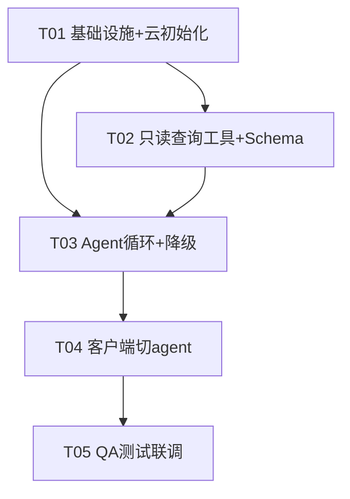

# AI 助理 · 云端聊天 Agent 接入 · 架构设计 + 任务分解

> 架构师：**高见远（Gao）** ｜ 版本：`20260722k-agent-v1` ｜ 技术栈：Node.js 云函数 + Swift 客户端
> 配套图：`docs/class-diagram.mermaid`（组件/类图）、`docs/sequence-diagram.mermaid`（调用时序）

---

## 0. 决策基线（来自团队确认，不再反问）

| 项 | 结论 |
|---|---|
| 后端 LLM | 商汤 SenseNova：`sensenova`(sensechat-vision) / `sensenovaText`(sensechat-turbo) |
| 第一版范围 | **只读（read-only）**：Agent 只查询用户已有数据，绝不创建/修改/删除 |
| 前端边界 | `ChatView.processNext` 的「待办/账单/食物」本地快捷路径**保持不变**；Agent 只接管问答/闲聊/查询汇总 |
| CloudBase 环境 | `cloud1-d1ga55pizf294dbe9-1445590522`（上海） |
| 数据集合 | `aia_records`，字段 `_id, userId, type, updatedAt(秒), deleted(墓碑), payload` |

---

## 1. 实现方案 + 框架选型

### 1.1 链路总览

在现有 `recognize` 云函数（一个纯 LLM 代理）中**新增 `mode: "agent"` 分支**：

```
App(ChatView.isQuestionLike) → RecognizeService.chat(mode:"agent", userId, text, context)
  → POST /recognize → exports.main 路由到 handleAgent
    → Agent 循环：system+context+text + tools  → SenseNova 返回 tool_calls
      → 执行只读工具（查 aia_records）→ 回填结果 → 模型生成最终回复
    → 降级分支：无 tool_calls / 不支持 tools → handleChat(context-only 兜底)
```

### 1.2 核心难点与方案对比

**难点**：`recognize` 当前是「无状态纯代理」——只用 `https` 调外部模型，**没有任何 CloudBase 数据库访问能力**。要支持"问我上个月咖啡花了多少"，就不能只靠客户端上传的 3 档聚合摘要（那只能答 today/yesterday/last7Days 的固定汇总，无法答任意自由查询）。

| 方案 | 做法 | 评价 |
|---|---|---|
| **A（推荐）** | 在 `recognize` 引入 `@cloudbase/node-sdk`，初始化云环境，实现真实**只读查询工具** `query_*`；客户端 `body.context` 仅作降级兜底 | ✅ 数据精确、按需取数、隐私好、token 省、单一数据源；降级路径仍可用旧上下文 |
| B（对比） | 让客户端把**全量原始记录**都传上来（`body.records`）塞进 prompt，模型直接答 | ❌ 上行体积大、隐私全暴露、长上下文易溢出/变贵、客户端需大改、且仍无法做可靠聚合 |

**为什么选 A**：自由查询（"3 月吃了几次火锅""上周运动几天"）靠客户端固定摘要答不了；服务端按 `userId+type+时间范围` 精确过滤，返回最小必要数据，既准又省。客户端 `buildContext()` 生成的 3 档摘要**保留**——它作为轻量兜底上下文（降级时直接用）和"小查询省一次 DB 往返"的优化，不是唯一数据源。

### 1.3 架构模式与框架

- **模式**：在既有 `recognize` 云函数内做 `mode` 分支扩展（不新建函数，复用现有 HTTP 触发/部署链路）。
- **LLM 调用**：复用现有 `https` 直接调 SenseNova（OpenAI 兼容格式），新增 `tools` 参数支持 **function calling**。
- **DB 访问**：新增 `@cloudbase/node-sdk` 初始化同环境，仅做 `.where().get()` / 只读聚合。
- **新增模块**：`agentTools.js`（CloudBase 只读封装 + 4 个工具实现）、`agentSchema.js`（工具 JSON Schema）、`agentPrompt.js`（Agent 系统提示）。
- **降级**：若模型无 `tool_calls`、或 provider 不支持 tools、或 `userId` 缺失、或 CloudBase 初始化失败 → 一律退回现有 `handleChat`（context-only）。**`mode:"chat"` 原路径完整保留**，新旧客户端向后兼容。
- **客户端**：仅改 `RecognizeService.chat` 一处（切 `mode:"agent"` + 带 `userId` + 改用 `sensenovaText`），`ChatView.swift` **无需改代码**（路由已正确，`isQuestionLike` 走 `.chat`）。

---

## 2. 文件列表（新建 / 修改，相对路径）

> 根目录参考：云函数 `云函数/recognize/`，客户端主工程 `AIA/AIA/`

| 文件 | 状态 | 说明 |
|---|---|---|
| `云函数/recognize/index.js` | **修改** | 新增 `mode:"agent"` 分支 → `handleAgent`；修正通用回应拦截（跳过 agent）；`FN_VERSION` 升 `20260722k-agent-v1`；引入 `agentTools / agentSchema / agentPrompt` |
| `云函数/recognize/package.json` | **修改** | `dependencies` 增加 `@cloudbase/node-sdk` |
| `云函数/recognize/agentTools.js` | **新建** | CloudBase 初始化 + 通用 `queryRecords` + `query_bills/query_foods/query_health/get_summary`，全部只读 |
| `云函数/recognize/agentSchema.js` | **新建** | 4 个工具的 function-calling JSON 定义（供 `tools` 参数） |
| `云函数/recognize/agentPrompt.js` | **新建** | Agent 系统提示（角色"阿宝" + 只读铁律） |
| `AIA/AIA/RecognizeService.swift` | **修改** | `chat(text:context:)` 改 `mode:"agent"`、带 `userId`、provider 改 `sensenovaText` |
| `AIA/AIA/AgentChatRequest.swift` | **新建** | 类型化请求模型（userId/mode/text/context/provider），让改动稳健可测 |
| `AIA/AIA/ChatView.swift` | **无需改动**（登记备查） | `processNext`/`isQuestionLike` 路由已正确，本地快捷路径保持；仅需回归验证 |
| `云函数/recognize/test/agentTools.test.js` | **新建** | 工具只读性 + 查询正确性单测（mock CloudBase） |
| `云函数/recognize/test/agentLoop.test.js` | **新建** | Agent 循环（tool_calls 解析 + 回填 + 降级）单测（mock LLM） |
| `docs/agent-qa-checklist.md` | **新建** | 端到端 QA 场景清单 |

---

## 3. 数据结构和接口（工具 Schema）

### 3.1 组件 / 类图

见 `docs/class-diagram.mermaid`（Mermaid `classDiagram`，展示 `RecognizeFunction / AgentLoop / AgentTools / CloudBaseClient / SenseNovaClient / AgentSchema / AgentPrompt` 及依赖关系）。

### 3.2 工具 JSON Schema（function calling）

所有工具均为**只读**；入参 `userId` 必须原样来自客户端，不得编造。

**① query_bills** — 查询账单（支出/收入），按时间范围 + 可选分类过滤
```json
{
  "type": "function",
  "function": {
    "name": "query_bills",
    "description": "查询用户的账单记录（支出/收入），可按时间范围和分类过滤。仅读取已同步数据，不创建或修改任何记录。",
    "parameters": {
      "type": "object",
      "properties": {
        "userId":  { "type": "string", "description": "用户唯一ID，必须原样传入" },
        "from":    { "type": "number", "description": "起始时间，秒级Unix时间戳；0=不限制" },
        "to":      { "type": "number", "description": "结束时间，秒级Unix时间戳；0=不限制" },
        "category":{ "type": "string", "description": "分类过滤，如 '餐饮'/'交通'/'超市'；可省略" }
      },
      "required": ["userId", "from", "to"]
    }
  }
}
```

**② query_foods** — 查询饮食记录，按时间范围 + 可选餐次过滤，附营养汇总
```json
{
  "type": "function",
  "function": {
    "name": "query_foods",
    "description": "查询用户的饮食记录，可按时间范围和餐次过滤，返回明细与营养汇总（热量/蛋白/碳水/脂肪）。只读。",
    "parameters": {
      "type": "object",
      "properties": {
        "userId": { "type": "string", "description": "用户唯一ID" },
        "from":   { "type": "number", "description": "起始时间，秒级Unix时间戳；0=不限制" },
        "to":     { "type": "number", "description": "结束时间，秒级Unix时间戳；0=不限制" },
        "meal":   { "type": "string", "description": "餐次过滤：早餐/午餐/晚餐/加餐；可省略" }
      },
      "required": ["userId", "from", "to"]
    }
  }
}
```

**③ query_health** — 查询健康指标最新值，可选指标名
```json
{
  "type": "function",
  "function": {
    "name": "query_health",
    "description": "查询用户的健康指标最新值（如体重、血压、步数），可按指标名过滤。只读。",
    "parameters": {
      "type": "object",
      "properties": {
        "userId": { "type": "string", "description": "用户唯一ID" },
        "metric": { "type": "string", "description": "指标名过滤，如 '体重'/'血压'；省略则返回全部最新指标" }
      },
      "required": ["userId"]
    }
  }
}
```

**④ get_summary** — 生成 today/yesterday/last7Days 聚合摘要（云端重算 `buildContext`）
```json
{
  "type": "function",
  "function": {
    "name": "get_summary",
    "description": "生成指定时间范围的聚合摘要（账单收支、饮食营养、待办、健康），等价于客户端 buildContext 的云端重算。只读。",
    "parameters": {
      "type": "object",
      "properties": {
        "userId": { "type": "string", "description": "用户唯一ID" },
        "range":  { "type": "string", "enum": ["today","yesterday","last7Days"], "description": "聚合范围" }
      },
      "required": ["userId", "range"]
    }
  }
}
```

**只读约束（每个工具强制）**：查询条件必须包含 `userId` 等值匹配 + `deleted: false`（墓碑过滤）；只允许 `.where().get()` 或只读 `.aggregate()`；**绝不允许** `.add/.update/.set/.remove/.doc().update` 等写操作。

### 3.3 工具返回结构约定

工具内部统一返回 `{ code, data, message }`；Agent 把 `data` 序列化为字符串回填给模型。

| 工具 | `data` 结构 |
|---|---|
| `query_bills` | `{ "list": [ {merchant, amount, currency, category, time, note, isIncome} ], "summary": { income, expense, count } }` |
| `query_foods` | `{ "list": [ {name, calories, protein, carbs, fat, portion, meal, date} ], "summary": { totalCalories, totalProtein, totalCarbs, totalFat, count } }` |
| `query_health` | `{ "list": [ {metric, value, unit, date} ] }`（按 metric 取最新一条） |
| `get_summary` | `{ "range", "bills":{income,expense,count}, "foods":{totalCalories,...}, "reminders":[title,due,done], "health":[{metric,value,unit}] }` |

> 分页/限量：建议 `query_*` 默认 `limit(50)`，`get_summary` 优先返回聚合而非明细，防止超长上下文（详见 §8 待明确）。

---

## 4. 程序调用流程（时序图）

见 `docs/sequence-diagram.mermaid`（Mermaid `sequenceDiagram`）。要点：

- **正常分支**：`user → ChatView → RecognizeService.chat(mode:agent) → recognize:handleAgent → AgentLoop → SenseNova(callWithTools)`；若返回 `tool_calls`，循环执行只读工具（查 `aia_records`）→ 回填 `role:tool` 消息 → 再调模型，直到无 `tool_calls` 或达上限（**最多 5 轮**）→ 返回最终 `reply`。
- **降级分支**（alt）：模型无 `tool_calls` / provider 不支持 tools / `userId` 缺失 / CloudBase 不可用 → `handleAgent` 退化为 `handleChat(context-only)`，用客户端 `body.context` 兜底回答。

---

## 5. 任务列表（按依赖 / 实现顺序）

> **任务数说明**：为满足架构分解「单文档任务数 ≤ 5」的硬约束，将原建议的 T1–T7 收敛为 **5 个实现任务**（基础设施合并为首任务），覆盖度 1:1。若团队希望按 T1–T7 更细粒度交付，可在工程师阶段把 T01–T05 直接展开，无额外设计成本。

| ID | 任务名 | 源文件 | 依赖 | 优先级 |
|---|---|---|---|---|
| **T01** | 项目基础设施与云环境初始化 | `云函数/recognize/package.json`、`云函数/recognize/index.js`、`云函数/recognize/agentTools.js` | — | P0 |
| **T02** | 只读查询工具与工具 Schema | `云函数/recognize/agentTools.js`、`云函数/recognize/agentSchema.js`、`云函数/recognize/agentPrompt.js` | T01 | P0 |
| **T03** | Agent 循环、工具解析与降级兼容 | `云函数/recognize/index.js`、`云函数/recognize/agentSchema.js`、`云函数/recognize/agentPrompt.js` | T01, T02 | P0 |
| **T04** | 客户端最小改动（切 agent 模式） | `AIA/AIA/RecognizeService.swift`、`AIA/AIA/AgentChatRequest.swift`、`AIA/AIA/ChatView.swift`（备查） | T03 | P1 |
| **T05** | QA 测试与联调 | `云函数/recognize/test/agentTools.test.js`、`云函数/recognize/test/agentLoop.test.js`、`docs/agent-qa-checklist.md` | T04 | P1 |

**各任务交付要点**
- **T01**：`package.json` 加 `@cloudbase/node-sdk`；`index.js` 引入 SDK 并 `tcb.init({env})`，新增 `mode:"agent"` 入口分支与通用回应拦截的 agent 豁免，新增 `agentTools.js` 骨架（CloudBase 客户端 + `queryRecords` 占位）；升 `FN_VERSION`。
- **T02**：`agentTools.js` 实现 4 个只读工具（基于 `queryRecords` 按 `type` 过滤 + 聚合）；`agentSchema.js` 落地 §3.2 四个 JSON 定义；`agentPrompt.js` 落地只读系统提示。
- **T03**：`index.js` 实现 `handleAgent`（组装 system+context+text+tools → 调模型 → 解析 `tool_calls` → 循环回填 → 生成回复）；实现降级（无 `tool_calls`/不支持/无 userId/DB 失败 → `handleChat`）；`mode:"chat"` 路径原样保留。
- **T04**：`RecognizeService.chat` 改 `mode:"agent"`、注入 `CloudSyncManager.userId`、provider 改 `sensenovaText`；新增 `AgentChatRequest.swift` 类型化请求；回归验证 `ChatView` 无需改动、本地快捷路径不变。
- **T05**：工具只读性/正确性单测 + Agent 循环（tool_calls 解析、回填、降级）单测 + 端到端 QA 清单（提问路由、自由查询、只读校验、降级、向后兼容）。

### 5.1 任务依赖图



---

## 6. 依赖包列表

| 包 | 版本建议 | 用途 | 变更 |
|---|---|---|---|
| `@cloudbase/node-sdk` | `^2.7.0`（以官方最新 2.x 为准） | 云函数内访问 CloudBase 数据库（只读查询） | **新增**，写入 `云函数/recognize/package.json` 的 `dependencies` |
| `https`（Node 内置） | — | 调 SenseNova（保持现状，无需新增） | 不变 |
| 客户端依赖 | — | Swift 现有网络层，无新增三方库 | 不变 |

- `云函数/recognize/package.json` **需要改**：从 `{ "dependencies": {} }` 增加 `@cloudbase/node-sdk`。
- **运行时**：建议 CloudBase 云函数 Node 16+（node-sdk 2.x 要求）；部署前 `npm install` 生成 `package-lock.json` 一并上传。
- **初始化方式**（见 §8 待确认）：同环境云函数内 `tcb.init({ env: ENV_ID })` 通常可免密；若走密钥则需在 CloudBase 配置 `TCB_SECRET_ID/TCB_SECRET_KEY` 环境变量。

---

## 7. 共享知识（跨文件约定）

1. **userId 命名统一**：云函数入参与 CloudBase 查询字段均用 `userId`（与集合字段一致，非 `openid`）；工具入参 `userId` 必须来自客户端 `body.userId`，**不得硬编码/编造**。
2. **时间单位统一**：全部使用**秒级 Unix 时间戳**（与 `updatedAt`/`payload.time`/`payload.date` 一致）；工具 `from/to` 均为秒；跨端转换时显式注明单位。
3. **只读铁律**：Agent 工具只允许 `.where().get()` 或只读 `.aggregate()`；**绝不**出现 `.add/.update/.set/.remove/.doc().update`；查询必须带 `userId` + `deleted: false`。
4. **系统提示强制约束**（agentPrompt.js）：角色"阿宝"；"只能读取、不创建/修改/删除任何记录；没查到的数据明确说『我这边暂时没看到』，不编造"。
5. **统一响应结构**：云函数返回 `{ ok: bool, reply: string, toolsUsed?: string[], ver }`；工具内部返回 `{ code, data, message }`；客户端 `ChatResponse` 只解 `ok/reply`（与现结构兼容，无需改）。
6. **循环安全**：Agent 循环最大 **5 轮**；超出直接基于已收集结果生成最终回复或降级，杜绝无限循环。
7. **环境 id 常量**：`cloud1-d1ga55pizf294dbe9-1445590522` 集中在 `agentTools.js` 定义，勿散落。
8. **降级一致性**：任何异常（无 userId / DB 失败 / 无 tool_calls / provider 不支持 tools）都收敛到 `handleChat(context-only)`，保证"始终有回复"，且 `mode:"chat"` 旧路径完全保留。

---

## 8. 待明确事项（需用户 / team-lead 确认）

1. **分页/限量**：`query_*` 是否默认 `limit(50)`？超长结果如何截断（截断明细 / 仅返汇总）？建议默认 50 + summary 优先。
2. **SenseNova function calling 实测**：`https://token.sensenova.cn/v1/chat/completions` 是否对 tools 需要额外 header（如 `X-Request-Id`）？`sensechat-vision` 与 `sensechat-turbo` 哪个对 tools 更稳？**本设计默认 Agent 用 `sensenovaText`(sensechat-turbo)**。
3. **`mode:"agent"` 与 `mode:"chat"` 并存还是替换**：本设计默认**并存**（agent 为默认新路径，chat 保留做兜底/兼容旧客户端），请确认。
4. **`body.context` 是否仍每次发送**：Agent 成功走工具后可忽略该摘要，但仍建议保留发送作为降级兜底与省小查询，请确认保留策略。
5. **对话历史是否落库**：`type:"chat"` 写 `aia_records` 会引入写操作，**违反只读**；本版不写。若需记忆上下文，需另议（建议放客户端本地，不进云库）。
6. **node-sdk 初始化方式**：同环境云函数免密 vs 显式密钥（影响 `agentTools.js` 写法），请按 CloudBase 实际环境确认。

---

## 9. 收尾

**设计完成，可进入工程师阶段。**
（交付物：`docs/system_design.md`、`docs/class-diagram.mermaid`、`docs/sequence-diagram.mermaid`；任务已收敛为 T01–T05，覆盖原 T1–T7 全部内容。）
